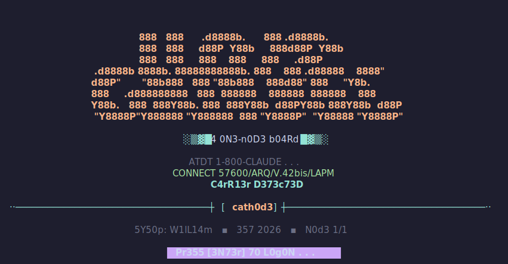
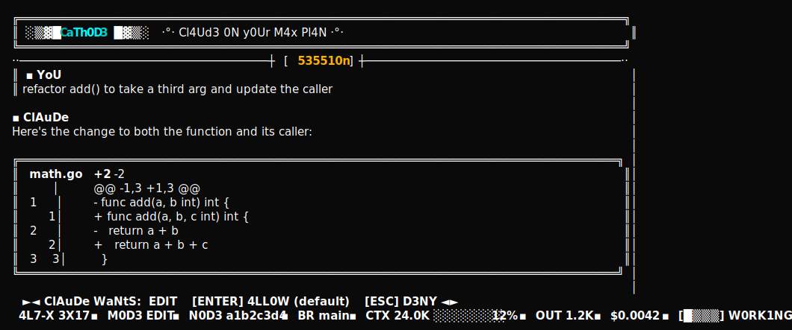

# Cathode

A **Bubble Tea TUI over the Claude Code stream-json protocol** (wordmark: `cath0d3`).

<p align="center">
  <br><br>
  
</p>

<sub>Rendered in the built-in **Catppuccin Mocha** theme — the look is switchable, see <a href="#themes">Themes</a>.</sub>

The agent loop, context management, tool execution, and auth all live in the
official `claude` binary, which runs as a long-lived subprocess. This program
owns only the terminal UI and the stdin/stdout plumbing — so you build your own
experience without re-implementing an agent, and you ride your **Max
subscription** because we never set an API key.

## Features

- **Rides your Pro/Max subscription** — drives the real `claude` CLI as a subprocess and scrubs `ANTHROPIC_API_KEY` / `ANTHROPIC_AUTH_TOKEN` from its env, so it never silently falls back to API billing.
- **Four permission modes** — `plan`, `ask`, `build` (auto-accept edits), `bypass`; cycle with `shift+tab` or `/mode`.
- **Inline approvals** — in `ask` mode every gated tool call raises a `[ENTER] allow · [ESC] deny` bar (served by a hand-rolled in-process MCP permission server); edits show the diff before you decide.
- **Visual diff cards** — `Edit` / `Write` / `MultiEdit` render as line-numbered red/green diffs instead of raw JSON.
- **Markdown replies** — Claude's output is rendered with Glamour and reflows on resize.
- **Session resume** — `ctrl+r` (or `/sessions`) fuzzy-filters `claude`'s own session history and re-execs into the one you pick.
- **Command palette** — `ctrl+t` runs slash commands: `/model`, `/compact`, `/mouse`, `/cwd`, `/clear`, …
- **11 themes + header animations** — `/theme` and `/settings`, with live preview, persisted across launches (see [Themes](#themes)).
- **Live status bar** — permission mode, session id, git branch, a context-pressure gauge that auto-grows 200K → 2M, output tokens, and running cost.
- **Info sidebar** — `ctrl+g` / `/sidebar` toggles an at-a-glance BBS info rail.
- **Bring your own tools** — point `-mcp` at a `.mcp.json` to wire extra MCP tools alongside the built-in approvals server.
- **Prompt history & queueing** — `↑` / `↓` recalls past prompts; type while Claude is busy and messages queue, draining one per turn.

## Why this architecture (vs forking Crush/OpenCode)

Those are native API-client agents: to use Max they route a subscription OAuth
token through the API, the pattern Anthropic restricted in early 2026. Here the
engine *is* Claude Code, so subscription use stays inside its intended path. We
borrow their **TUI craft** (all MIT-licensed) — markdown rendering, message
cards, plan/build modes — not their engine.

## Run it

```bash
claude login            # one-time, with your Pro/Max credentials only
go mod tidy             # fills indirect deps + go.sum via the normal proxy
go run .                # AUTO (build) by default; -mode ask | plan | bypass to switch
```

Preflight: run `claude` once interactively and confirm `/status` shows the
subscription route (not API credits) before relying on this.

## Build & install

`make` wraps the `go` commands (needs Go 1.22+):

```bash
make build      # compile ./cathode
make run        # build, then launch in ask mode
make test       # go test ./...
make tidy       # go mod tidy (writes go.sum)
make install    # build + copy to ~/.local/bin  (override: make install PREFIX=/usr/local/bin)
make uninstall  # remove the installed binary
make reinstall  # clean + install
make watch      # rebuild + reinstall on every *.go save (needs entr)
make clean      # remove ./cathode
```

`install` creates `$PREFIX` if needed and warns when it isn't on your `PATH`.

## Flags

| flag     | default | meaning                                                                   |
|----------|---------|---------------------------------------------------------------------------|
| `-mode`  | `build` | `ask` (gated, shows approval pane) | `plan` (read-only) | `build` (auto-accept edits) | `bypass` |
| `-mcp`   | `""`    | path to a `.mcp.json` that wires your internal tools                      |
| `-model` | `""`    | pin a model (e.g. `sonnet`); empty uses the account default               |
| `-spinner`| `bar`  | working throbber: `bar` | `shade` | `block` | `arrow` | `scan`           |

## Themes

The look is switchable at runtime — pick from the prompt, preview live as you move the
cursor, and it persists across launches:

- `/theme` — color palette. 11 built in: **BBS** (default neon), Dracula, Nord,
  Solarized Dark, Tokyo Night, Gruvbox, One Dark, Monokai, **Catppuccin Mocha**,
  GitHub Dark, Rosé Pine.
- `/settings` — the theme picker plus the **header animation** (rainbow sweep,
  single-hue shimmer cyan / amber / magenta, theme-color, pulse, or off) and an
  **animation FPS** cap (24 / 12 / 6 / 3) — lower means fewer idle redraws / less
  CPU, and setting the header animation to *off* stops idle repainting entirely.

The screenshots above are rendered in Catppuccin Mocha.

## Files

Small files by responsibility (the project keeps each one scannable).

**Process & protocol**

| file | role |
|------|------|
| `main.go` | flags, mode→permission mapping, wires engine + Bubble Tea program + reader goroutine |
| `engine.go` | the long-lived `claude` subprocess: spawn, env-scrub, bidirectional NDJSON stdin/stdout |
| `events.go` | `Envelope` structs + parser for the stream-json output |
| `control.go` | control-request envelopes on stdin (set permission mode, interrupt) |
| `stream.go` | routes one parsed envelope into the model (`handleEvent`) |
| `debug.go` | the `-debug` raw-traffic logfile sink |

**UI loop (Bubble Tea)**

| file | role |
|------|------|
| `model.go` | the model struct, transcript entry kinds, `Init` |
| `update.go` | the `Update` dispatcher + lazy animation-tick arming |
| `view.go` | `View` + `renderBackground` (chrome + transcript + prompt + status) |
| `keys.go` | keyboard dispatch |
| `scroll.go` | the transcript viewport + scroll / auto-follow |
| `render.go` | `rebuild` / `renderEntry` — entries → viewport |
| `diff.go` | edit-tool detection + the line-numbered red/green diff card |
| `tools.go` | typed tool-call / tool-result cards |
| `transcript.go` | rehydrate prior turns from claude's session JSONL on resume |

**Chrome & theme**

| file | role |
|------|------|
| `chrome.go` | banner, scrollbar, spinner frames, queued-message tray |
| `status.go` | the DOS-style status bar + context gauge + git branch |
| `sidebar.go` | the BBS info rail |
| `theme.go` | palettes, styles, `applyTheme`, the theme list |
| `rainbow.go` | header-wordmark animation (shimmer / rainbow + the fps tick) |
| `text.go` | leet / studly / flavor chrome-text helpers |
| `splash.go` | the boot/login splash screen |
| `logos.go` | figlet wordmark variants for the splash |

**Modals & input**

| file | role |
|------|------|
| `picker.go` | the fuzzy filter-and-pick modal (sessions / commands / theme / fps) + scrollbar |
| `overlay.go` | ANSI-aware splice that floats a modal over the transcript |
| `commands.go` | the slash-command table + help modal |
| `settings.go` | persisted settings (header / theme / fps) + their pickers |
| `approvals.go` | the in-process MCP permission server (`--permission-prompt-tool`) |

**State & persistence**

| file | role |
|------|------|
| `state.go` | `$XDG_STATE_HOME/cathode` resolution + legacy-dir migration |
| `sessions.go` | the resume index (recently-touched sessions) |
| `claude_sessions.go` | discovers claude's own session JSONLs for the resume picker |
| `history.go` | the prompt-history store |
| `models.go` | `/model` picker rows from the initialize handshake |

Unit tests live in `*_test.go` files (e.g. `approvals_test.go`, `render_test.go`, `animation_test.go`); the SVG marketing assets are regenerated by the opt-in `asset_gen_test.go` (see [Themes](#themes)).

## The BBS look (and reskinning)

The look is elite-ANSI-scene BBS: base-16 neon on black, CP437 double borders,
`░▒▓█` gradient flourishes, a block-letter wordmark, scene dividers
(`··──┼[ TAG ]┼──··`), `▪`/`°` ornaments, l33t numerals, and StUdLy caps. A boot
splash (`splash.go`) opens with the wordmark, a faux modem handshake, and a
`press [ENTER] to logon` prompt (dismissed by the first keypress).

Discipline: the leet/studly/ornament treatment runs on *chrome only* — banner,
dividers, status, labels, splash. Claude's replies and the diff code stay
plain and readable. The `leet`, `studly`, `flavor`, and `sceneDivider` helpers
live in `theme.go`; reskin by swapping the nine palette constants. The wordmark
is the `appName` constant.

The splash shows one of several wide block logos at random each launch
(`logoVariants` in `logos.go`), generated offline with figlet. Add or swap a
variant by running `figlet -f <font> -w 200 "cath0d3" | tr '\140' "'"` (any
font — `colossal`, `epic`, `poison`, `cosmic`, or `toilet -f pagga` for
shade-block CP437) and pasting the output as a new entry; narrow terminals fall
back to the compact `logoCompact`. While Claude works, an animated throbber runs in the
status bar; choose its frames with `-spinner` (the `shade` pulse `░▒▓█` and the
`scan` knight-rider are the most period-correct).

## Done vs next

Done: markdown rendering (Glamour), bordered message cards, plan/build/ask
modes, MCP tool-wiring hook, and an OpenCode-style visual diff card for
`Edit`/`Write`/`MultiEdit` tool calls (filename + counts, old/new line-number
gutter, red/green hunks), and an inline permission/approval pane: in `ask`
mode Claude routes each gated tool through our in-process MCP server, the TUI
shows the proposed change (diff for edits) and a `[y] allow / [n] deny` bar, and
the decision is returned to Claude.

Next / deferred: (a) token-by-token streaming via `--include-partial-messages` (trades
off against markdown); (b) syntax-token highlighting inside the diff — chroma is
already in the tree via glamour, so per-line token coloring on top of the red/
green background is a natural follow-on.

## Known sharp edges

- The stdin envelope (`outUser` in engine.go) is the under-documented half of
  the protocol; its shape matches the Agent SDK streaming-input format.
- `ANTHROPIC_API_KEY` / `ANTHROPIC_AUTH_TOKEN` are stripped from the subprocess
  env on purpose — either present would silently bill the API.
- `approvals.go` hand-rolls a minimal Streamable-HTTP MCP server. It answers a
  POST as either plain JSON or an SSE `message` event, chosen from the client's
  Accept header — so it covers a client that insists on `text/event-stream`
  (which Claude's does advertise). Both paths are unit-tested; the one thing not
  exercised here is the real `claude` client itself. If it needs more of the spec
  (a GET SSE channel, `Mcp-Session-Id` round-tripping), `handle` is the spot. The
  permission tool's input (`tool_name` + `input`) and result
  (`{"behavior":"allow"|"deny", ...}`) match the documented contract.
- The approval flow only fires for tools that no static allow/deny rule already
  settled, so don't `--allowedTools` the edit tools if you want to approve them.
